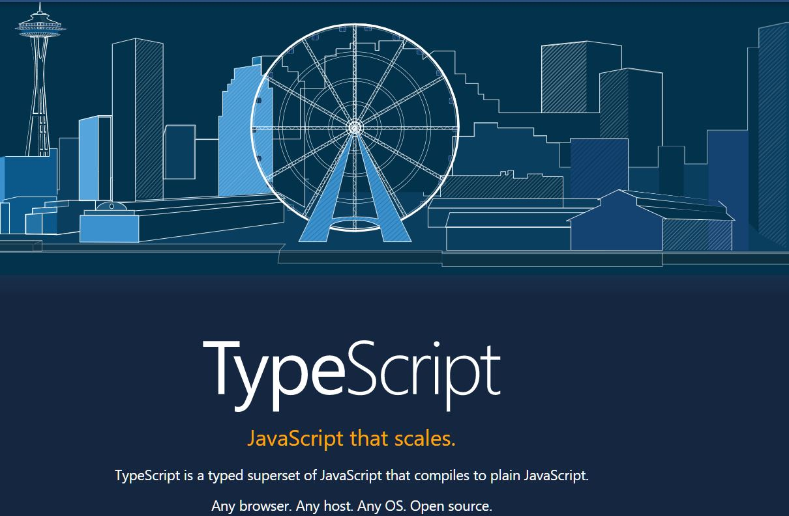
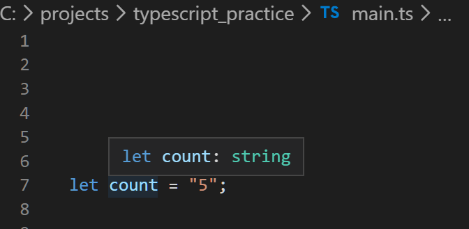

# TypeScript Basics

- Official site: https://www.typescriptlang.org/



---

### Tutorial I followed: [TypeScript Tutorial for Angular and React Developers | Mosh](https://www.youtube.com/watch?v=NjN00cM18Z4&list=WL&index=8&t=0s)

---

### General

- How to install TypeScript

```
npm install -g typescript
```

- File extension of TypeScript: .ts

- TypeScript can run any regular JavaScript code.

### Compilation

- In order to read .ts files, we need to compile it to .js files

```javascript
tsc {filename.ts} //This command will compile .ts file to .js file with the same filename

node {filename.js} //Then we can run the .js file with our node command

tsc main.ts && node main.js //Shorthand: Compile .ts & run in Node.js
```

### Variable Declaration

- TypeScript will be compiled to ES5 JavaScript (so that all browsers can read it).

- This also means that the 'let' keyword in TypeScript will be automatically compiled to 'var' in ES5 JavaScript.

- However, we should still use 'let' to declare variables in TypeScript (So that we can see the error message during the compiling process if there's one). The compiled .js file can still run, but it would be easier for us to detect errors during compilation.

```
main.ts:6:26 - error TS2304: Cannot find name 'i'.
6   console.log(`Finally ${i}`);
                           ~
Found 1 error.
```

### Data Types

- After declaring a variable in TypeScript, if you hover your mouse on the variable, you'll see the data type of the variable.



- Strict Type

```typescript
let count: number; // Declare variable 'count' is a number

count = 5;
count = "aaa"; // VS code will show an error message if you define a non-number value
```

- Common data types in TypeScript & enum

```typescript
let a: number;
let b: boolean;
let c: string;
let d: any; // any data type
let e: number[] = [1, 2, 3]; // array of numbers & [optionally] initialise the array as [1, 2, 3]
let f: any[] = [1, true, "a", false]; // array of any data types & [optionally] initialise the array as [1, true, "a", false]

enum Color {
  Red = 0,
  Green = 1,
  Blue = 2
} //We specify the numbers here for explicitness. In general, the numbers will be automatically assigned.
let backgroundColor = Color.Red;
```

### Type Assertions

```typescript
let message;
message = "abc";

let endWithC = (<string>message).endsWith("c"); //Method 1: more common
let alternativeWay = (message as string).endsWith("c"); //Method 2
```

### Interfaces

- **Naming convention (pascal case)**: Distinguished from CamelCase by the restriction that the first letter must be upper case.

- Interface is purely decorative. It cannot include any implementation (i.e. logic or functions).

```typescript
//interface: We use pascal case for interface
interface Point {
  x: number;
  y: number;
}

//function
let drawPoint = (point: Point) => {
  // actual function code here
};

drawPoint({
  x: 1,
  y: 2
});
```

### Classes

- **Definition**: We use classes to group variables (properties) and functions (methods) that are highly related.

```typescript
class Point {
  x: number; // field: storing data
  y: number; // field: storing data

  // method
  draw() {
    //... actual code/logic here
  }

  // method
  getDistance(anotherPoint: Point) {
    //... actual code/logic here
  }
}
```

### Objects

- How to create a class with fields (x, y) and methods (draw() & getDistance())
- Need to use this.{property} when refer to properties in methods
- How to create a new object from the class: let point = new Point();
- Use dot notation to refer to properties & methods on an object

```typescript
// 'Point' here is a class
class Point {
  x: number;
  y: number;

  draw() {
    console.log("X: " + this.x + ", Y: " + this.y); //We need to use 'this' here
    // console.log(`X: ${this.x}, Y: ${this.y}`); //string interpolation
  }

  getDistance(anotherPoint: Point) {
    //...
  }
}

// 'point' here is an 'object'
let point = new Point(); //shorthand (longhand: let point: Point = new Point();)
point.x = 1;
point.y = 2;
point.draw();
```

### Constructors

- How to use a constructor in TypeScript
- How to make a parameter optional in constructor

```typescript
class Point {
  x: number;
  y: number;

  //'?'after variables makes it optional
  //Once you make a variable optional, the variables on its right-hand side need to be optional as well
  constructor(x?: number, y?: number) {
    this.x = x;
    this.y = y;
  }

  draw() {
    console.log(`X: ${this.x}, Y: ${this.y}`);
  }
}

let point = new Point(); //Now we can create a new object without parameters
point.draw();
```

### Access Modifiers

- **Access modifiers**: to control the accessibility of certain members (fields & methods) of a class from outside.

- **Three types of access modifiers in TypeScript**:

**1. public (most common)**: Public is by default, so we usually don't specify it unless it's necessary.
**2. private (most common)**: Once it sets to 'private', we cannot change it after the object is initialised.
**3. protected**

```typescript
class Point {
  private x: number;  //How to set a property to 'private'
  y: number;          // 'y' still remains 'public'
```

### Access Modifiers in Constructor Parameters

- If we prefix access modifiers in our constructor parameters, TypeScript compiler will generate the fields (with exact the same names) and initialise the fields with values of the arguments for us.

```typescript
// Original

class Point {
  private x: number;
  private y: number;

  constructor(x?: number, y?: number) {
    this.x = x;
    this.y = y;
  }

  draw() {
    console.log(`X: ${this.x}, Y: ${this.y}`);
  }
}

let point = new Point(1, 2);

point.draw();

// With Access Modifiers in Constructor Parameters

class Point {
  constructor(private x?: number, private y?: number) {}

  draw() {
    console.log(`X: ${this.x}, Y: ${this.y}`);
  }
}

let point = new Point(1, 2);

point.draw();

// If you prefix our parameters in constructor with the Access Modifiers (either private or public)
// TypeScript compiler will generate these fields with exact the same names
// And we don't need the assignment (this.x = x;) either'
// TypeScript compiler will also initialise the fields with values of the arguments for us
```

### Properties

- **Use case of property**: If you have private fields, and you want to give a read-only access for the underlined field from the outside or you want to give users the access to set the value with some basic value validation
- **How to define a property**: Start with a keyword ('get' or 'set') and then the name of the property (x). After that, we'll have parentheses afterwards, just like a method. e.g. get x ()
- **How to use properties**: We can use properties as fields (not as methods anymore).
- **Definition of properties**: a property looks like a field from the outside, but internally it's a method in the class. More specifically, it's a method of getter or setter, or a combination of getter & setter.

```typescript
class Point {
  //naming convention of fields: camel case
  //naming convention of underline fields in constructor: with a prefix underline
  constructor(private _x?: number, private _y?: number) {}

  draw() {
    console.log(`X: ${this._x}, Y: ${this._y}`);
  }

  //Getter method
  get x() {
    return this._x; //Inside the class, we do have access to the private members in the class (but we don't have the access from the outside)
  }

  //Setter method
  set x(value) {
    //Can only change the value of x if the value is within a range
    if (value < 0) throw new Error("Value can't be less than 0");
    this._x = value;
  }
}

let point = new Point(1, 2);
let x = point.x; //We can use properties as fields here (not as methods anymore).
point.x = 10; //We can use properties as fields here (not as methods anymore).
point.draw();
```

### Modules

- In TypeScript, each file (with either an export or import statement on the top) is a module.

- Import: main.ts
- Export: code_snippets\point.ts
